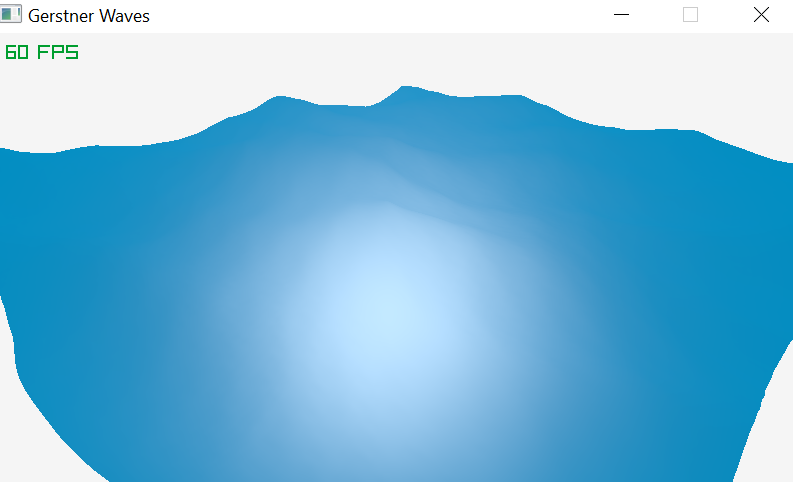

# Gerstner Waves Raylib

This is my implementation of Gerstner waves using Raylib to display the results. This project was a simple test project. To compile the project add the libraylib.a file under a folder called lib and type make on the command line. Please note the screenshot below does not do this simulation justice. The gerstner wave animates in real time when the code is actually running. I hope you all enjoy!

